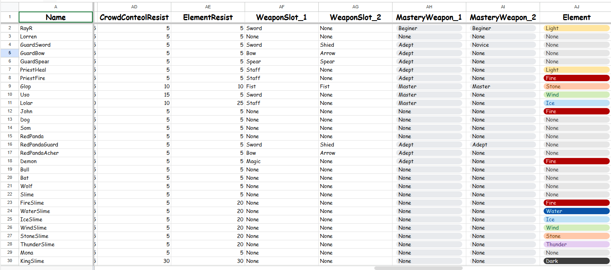

# Learning Data Management System

**Learning Data Management System** เป็นโปรเจกต์ที่พัฒนาด้วย Unity สำหรับทดลองสร้างระบบจัดการข้อมูลตัวละคร โดยเชื่อมต่อข้อมูลจาก **Google Sheets เข้ากับ Unity** และนำข้อมูลที่ได้รับมาแสดงผลบน UI ภายในโปรแกรม

โปรเจกต์นี้เน้นการทดลองจัดการ **Online Data** เพื่อให้สามารถแก้ไขหรือเพิ่มข้อมูลจาก Google Sheets และนำข้อมูลมาใช้งานภายใน Unity โดยไม่จำเป็นต้องกำหนดข้อมูลทั้งหมดไว้ภายในตัวโปรแกรม

Repository นี้รวบรวม **Source Code ที่ใช้ในการพัฒนาระบบ**, ภาพตัวอย่างการทำงาน และลิงก์ Google Sheets ที่ใช้เป็นข้อมูลตัวอย่างของโปรเจกต์

---

## 🖥️ ภาพรวมโปรเจกต์


ระบบสามารถโหลดข้อมูลตัวละครจาก Google Sheets และนำมาแสดงบน UI ภายใน Unity โดยข้อมูลของตัวละครประกอบด้วยหลายส่วน เช่น

- Name / Job
- HP / Max HP
- Attack / Defense
- Level / EXP
- Stamina / Mana
- Critical Rate / Critical Damage
- Weapon / Equipment
- Skills
- Element
- Team
- Reputation / Karma
- Character Image
- และข้อมูลอื่น ๆ

เมื่อมีการแก้ไขข้อมูลจาก Google Sheets และโหลดข้อมูลใหม่ ระบบจะนำข้อมูลล่าสุดมาใช้ในการแสดงผลภายใน Unity

---

## 🔄 การทำงานของระบบ

```text
Google Sheets
      ↓
Online Data / CSV
      ↓
UnityWebRequest
      ↓
Data.cs
      ↓
อ่านและแยกข้อมูล
      ↓
CharacterData
      ↓
CharacterSelection.cs
      ↓
สร้างรายชื่อตัวละคร
      ↓
เลือกตัวละคร
      ↓
แสดงข้อมูลบน Unity UI
```

ระบบจะเริ่มจากการโหลดข้อมูลจาก Google Sheets ผ่านระบบออนไลน์ จากนั้น `Data.cs` จะทำหน้าที่อ่านและแยกข้อมูลออกเป็นข้อมูลของตัวละครแต่ละตัว

เมื่อโหลดข้อมูลสำเร็จ ระบบจะสร้างรายชื่อตัวละครขึ้นมาตามข้อมูลที่ได้รับ และเมื่อผู้ใช้เลือกตัวละคร `CharacterSelection.cs` จะนำข้อมูลของตัวละครนั้นมาแสดงบน UI

---

## 📊 Google Sheets & Online Data



Google Sheets ถูกใช้เป็นแหล่งสำหรับจัดเก็บและจัดการข้อมูลตัวละคร โดยแต่ละแถวจะแทนข้อมูลของตัวละคร และแต่ละ Column ใช้สำหรับกำหนดข้อมูลประเภทต่าง ๆ เช่น

- ชื่อตัวละคร
- อาชีพ
- HP / Max HP
- Attack / Defense
- Level / EXP
- Stamina / Mana
- Equipment
- Weapon
- Skills
- Element
- Team
- Character Image URL
- และข้อมูลอื่น ๆ

ข้อมูลเหล่านี้จะถูกโหลดเข้าสู่ Unity และแปลงเป็นข้อมูล `CharacterData` ก่อนนำไปใช้งานภายในระบบ

### 🔗 Google Sheets

[▶ ดู Google Sheets ที่ใช้ในโปรเจกต์](ใส่ลิงก์_GOOGLE_SHEET_ตรงนี้)

> Google Sheets ที่เผยแพร่ใช้สำหรับแสดงตัวอย่างโครงสร้างข้อมูลของโปรเจกต์ โดยเปิดสิทธิ์สำหรับการดูข้อมูลเท่านั้น (View-only) และไม่สามารถแก้ไขข้อมูลได้

---

## 👤 Character Data


เมื่อเลือกตัวละครจากรายชื่อ ระบบจะนำข้อมูลของตัวละครนั้นมาแสดงบน UI โดยข้อมูลที่แสดงประกอบด้วย Stats และรายละเอียดต่าง ๆ ของตัวละคร

ระบบยังรองรับการโหลดรูปตัวละครจาก URL ที่กำหนดไว้ในข้อมูล และนำรูปที่โหลดมาแสดงบน UI ภายใน Unity

---

## ✨ ระบบที่พัฒนา

- ระบบเชื่อมต่อข้อมูลออนไลน์เข้ากับ Unity
- โหลดข้อมูลด้วย `UnityWebRequest`
- อ่านและแยกข้อมูล CSV
- จัดเก็บข้อมูลตัวละครด้วย `CharacterData`
- สร้างรายชื่อตัวละครจากข้อมูลที่โหลดมา
- ระบบเลือกตัวละคร
- แสดง Stats และข้อมูลตัวละครแบบ Dynamic
- แสดงข้อมูล Weapon, Equipment และ Skills
- โหลดรูปตัวละครจาก URL
- Refresh ข้อมูลจากแหล่งข้อมูลออนไลน์
- เปลี่ยนการแสดงผล UI ตามข้อมูลของตัวละคร
- ระบบเปิดและปิดหน้าข้อมูลต่าง ๆ

---

## 👨‍💻 หน้าที่ที่รับผิดชอบ

**Role: Game Developer**

หน้าที่หลักที่ผมรับผิดชอบภายในโปรเจกต์ ได้แก่

- ออกแบบโครงสร้างข้อมูลตัวละคร
- พัฒนาระบบเชื่อมต่อข้อมูลระหว่าง Google Sheets และ Unity
- พัฒนาระบบโหลดข้อมูลออนไลน์
- พัฒนาระบบอ่านและแยกข้อมูล CSV
- พัฒนาระบบจัดเก็บข้อมูลตัวละคร
- พัฒนาระบบสร้างรายชื่อตัวละครจากข้อมูลที่โหลดมา
- พัฒนาระบบเลือกตัวละครและแสดงข้อมูลบน UI
- พัฒนาระบบโหลดรูปภาพจาก URL
- ออกแบบและพัฒนา UI สำหรับแสดงข้อมูล
- ทดสอบและแก้ไขปัญหาการรับส่งข้อมูลระหว่าง Unity และ Google Sheets

---

## 📁 Source Code

Source Code ภายใน Repository ถูกแยกไว้ใน Folder `SourceCode`

```text
SourceCode/
│
├── Data.cs
├── CharacterSelection.cs
└── BtShow.cs
```

### `Data.cs`

ทำหน้าที่กำหนดโครงสร้างข้อมูล `CharacterData` รวมถึงโหลดข้อมูลออนไลน์ด้วย `UnityWebRequest` และแยกข้อมูลที่ได้รับเพื่อนำมาจัดเก็บเป็นข้อมูลของตัวละครแต่ละตัว

### `CharacterSelection.cs`

ทำหน้าที่สร้างปุ่มรายชื่อตัวละครจากข้อมูลที่โหลดมา เมื่อเลือกตัวละคร ระบบจะนำข้อมูล Stats, Equipment, Skills และข้อมูลอื่น ๆ มาแสดงบน UI

นอกจากนี้ยังรองรับการโหลดรูปตัวละครจาก URL และนำมาแสดงภายใน Unity

### `BtShow.cs`

ทำหน้าที่ควบคุมการเปิดและปิด UI บางส่วนภายในโปรแกรม รวมถึงการควบคุมปุ่มสำหรับใช้งานหน้าต่างข้อมูลต่าง ๆ

---

## 🛠️ เครื่องมือและเทคโนโลยีที่ใช้

- Unity
- C#
- Google Sheets
- CSV
- UnityWebRequest
- TextMeshPro
- Unity UI

---

## 📚 สิ่งที่ได้เรียนรู้จากโปรเจกต์

โปรเจกต์นี้ทำให้ผมได้เรียนรู้การนำข้อมูลจากภายนอกมาใช้งานร่วมกับ Unity แทนการกำหนดข้อมูลทั้งหมดไว้ภายในตัวโปรแกรม

ผมได้ฝึกการออกแบบโครงสร้างข้อมูล การโหลดข้อมูลออนไลน์ การอ่านและแยกข้อมูล CSV รวมถึงการนำข้อมูลจำนวนหลาย Field มาแสดงผลบน UI

นอกจากนี้ยังทำให้ผมเข้าใจแนวคิดของการแยกส่วน **ข้อมูล (Data)** ออกจากส่วน **การแสดงผล (UI)** มากขึ้น และเห็นถึงประโยชน์ของการจัดการข้อมูลจากภายนอก ซึ่งช่วยให้สามารถแก้ไขหรือเพิ่มข้อมูลได้โดยไม่จำเป็นต้องแก้ไขข้อมูลทั้งหมดภายใน Unity

โปรเจกต์นี้ยังเป็นประสบการณ์ในการทดลองเชื่อมต่อระบบภายนอกเข้ากับ Unity และเป็นพื้นฐานสำหรับการพัฒนาระบบจัดการข้อมูลที่มีขนาดใหญ่ขึ้นในอนาคต

---

## 📺 Video Demo

[▶ รับชมการทำงานของโปรเจกต์บน YouTube](ใส่ลิงก์_YOUTUBE_ตรงนี้)

---

## 📌 เกี่ยวกับ Repository นี้

Repository นี้จัดทำขึ้นเพื่อแสดง Source Code และกระบวนการพัฒนาระบบจัดการข้อมูลระหว่าง **Google Sheets และ Unity**

รูปตัวละคร Icon และ Asset บางส่วนภายในโปรเจกต์ถูกใช้สำหรับการทดสอบและแสดงผลของระบบ จึงไม่ได้รวม Asset ทั้งหมดไว้ภายใน Repository

Google Sheets ที่เชื่อมไว้ใน README เปิดให้เข้าดูข้อมูลในรูปแบบ **View-only** เพื่อแสดงตัวอย่างโครงสร้างข้อมูลที่ใช้ในการพัฒนาระบบ

Repository นี้มีจุดประสงค์เพื่อแสดงประสบการณ์ด้าน **Programming, Data Management และการเชื่อมต่อข้อมูลภายนอกเข้ากับ Unity**
